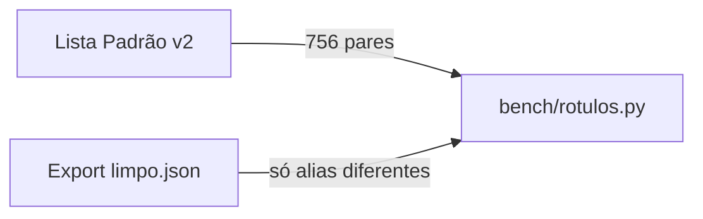

# SP-GT — Ground-Truth Automático (duas fontes: Lista Padrão + Export Full Base)

**Data:** 2026-06-28
**Status:** Aguardando revisão do usuário
**Origem:** Análise de bottlenecks — o ground-truth de 28 pares é o gargalo #1 do projeto. Sem ele, calibração, medição de progresso e comparação entre versões são estatisticamente frágeis.

## Problema

O benchmark atual (`bench/rotulos.py`) tem exatamente **28 pares** `(descrição, sigla)`. Isso é insuficiente para:
- Calibração probabilística (Platt/isotonic precisam de centenas)
- Detecção de regressão entre versões
- Avaliação por categoria (proteções vs chaves vs analógicos)
- Tomada de decisão confiável sobre qual pipeline usar

## Solução

Gerar centenas de pares de ground-truth combinando **duas fontes**, em ordem:

### Fonte 1 — Lista Padrão ADMS v2 (base)

A Lista Padrão (`docs/Pontos Padrao ADMS_v2.xlsx`) já contém a descrição canônica de cada sigla. Cada linha vira um par de GT:

| Sheet | Siglas válidas |
|---|---|
| DiscreteSignals | ~693 |
| AnalogSignals | ~63 |
| **Total** | **~756** |

```python
("DISJUNTOR NF (LIGADO/DESLIGADO/ABERTO/FECHADO)", "DJF1")
("BATERIA - FALHA", "BATA")
("Temperatura Óleo", "TOLE")
...
```

Isso cobre **todas as siglas conhecidas** de uma só vez — salto de 28 para ~756 pares.

**Problema resolvido:** a descrição canônica é limpa e padronizada, mas não representa como os sinais aparecem em planilhas reais (que têm typos, variações, ruído). Para isso serve a Fonte 2.

### Fonte 2 — Export Full Base limpo (variações reais)

O `docs/Export_base_Full__27_fev_2026.xlsx` (~98 MB) é a base ADMS de produção com ~237k sinais discretos e ~133k analógicos. Cada linha tem:

| Coluna | Conteúdo | Exemplo |
|---|---|---|
| `Signal Name` | Nome hierárquico (`_nome_hierarquico`) | `IMA_LT3_89-16_SECC` |
| `Signal Alias` | Descrição humana real | `Seccionadora 89-16 - Aberto/Fechado` |

Extraindo a **sigla** do último segmento do `Signal Name` e pareando com o `Signal Alias`, obtemos pares extras **apenas quando a descrição difere da canônica** (Fonte 1):

```python
# Já existe na Lista Padrão → descartar duplicata
("DISJUNTOR NF (LIGADO/DESLIGADO/ABERTO/FECHADO)", "DJF1")

# Descrição diferente → adicionar como variação real
("Disjuntor 52-1 NF Aberto/Fechado", "DJF1")
```

Isso adiciona **milhares de variações reais** ao GT.

## Etapas

### Etapa 1: Script de limpeza do Export Full Base

`scripts/limpar_full_base.py`

Lê o Export Full Base em streaming (`openpyxl read_only=True`) e gera `docs/Export_base_Full_limpo.json` com:

```json
[
  {
    "sheet": "DNP3_DiscreteSignals",
    "signal_name": "IMA_LT3_89-16_SECC",
    "signal_alias": "Seccionadora 89-16 - Aberto/Fechado",
    "signal_type": "Discrete",
    "measurement_type": "SwitchStatus"
  },
  ...
]
```

**Filtros aplicados:**

1. Mantém apenas sheets: `DNP3_DiscreteSignals`, `DNP3_AnalogSignals`, `DNP3_DiscreteAnalog`
2. Remove linhas onde `Signal Name` não segue o formato hierárquico (regex: pelo menos 2 segments separados por `_`, último segmento é a sigla)
3. Remove linhas com `Signal Alias` vazio, `#N/A` ou nulo
4. Remove duplicatas de `(Signal Alias, sigla)` — mesma descrição+sigla aparece uma vez
5. Remove `Signal Alias` idênticos com siglas diferentes (ambiguidade — não sabemos qual é o "certo")
6. Remove siglas que não existem na Lista Padrão v2 (não faz sentido testar contra siglas que o pipeline não conhece)

### Etapa 2: Script de geração do GT

`scripts/gerar_ground_truth.py`



1. Carrega Lista Padrão v2 → gera pares `(descrição, sigla)` para todas as ~756 siglas
2. Carrega Export limpo → para cada entrada, se `signal_alias` é diferente da descrição canônica daquela sigla, adiciona como par extra
3. Concatena tudo em `bench/rotulos.py` (formato atual, compatível com o benchmark)

### Etapa 3: Validação

- Loop de validação manual: N amostras aleatórias do GT gerado são verificadas contra a fonte
- `python -m pytest -q` (sem regressão nos testes existentes)
- `PYTHONPATH=src python bench/benchmark.py` (gate — agora com centenas de pares)

### Etapa 4: Benchmark com GT expandido

Com o GT grande, re-roda o benchmark completo e decide se as conclusões anteriores (82% acc@1, 95% precisão) se mantêm. Se houver mudança significativa, calibração precisa ser reavaliada (spec E de calibração probabilística).

## Artefatos gerados

| Artefato | Caminho | Conteúdo |
|---|---|---|
| Export Full Base limpo | `docs/Export_base_Full_limpo.json` | Sinais que seguem o padrão, deduplicados, sem ambigüidade |
| Ground-truth expandido | `bench/rotulos.py` (substitui o atual) | Pares da Lista Padrão + variações reais do Export |

## Fora de escopo

- Calibração dos scorers com o novo GT — é a spec E (treinamento/calibração probabilística), que vem depois
- Melhoria do matching em si — SP-GT só gera a régua para medir
- Sheets não-DNP3 (IEC 104, IEC 101, ICCP) — o GT cobre DNP3 que é o protocolo principal (~7.397 RTUs)
- Sinais analógicos do Export — a coluna `Signal Alias` existe, mas a sigla canônica de analógicos segue nomenclatura diferente (ex: `IA`, `VAB`) que precisa ser validada antes de incluir

## Critérios de aceite

1. Script de limpeza gera `Export_base_Full_limpo.json` com milhares de entradas válidas
2. Script de GT gera `bench/rotulos.py` com ~756 + N pares
3. Nenhum par tem sigla que não existe na Lista Padrão v2
4. Nenhum par tem `Signal Alias` repetido com sigla diferente (ambiguidade zero)
5. `python -m pytest -q` verde
6. `PYTHONPATH=src python bench/benchmark.py` roda sem erro com o novo GT
